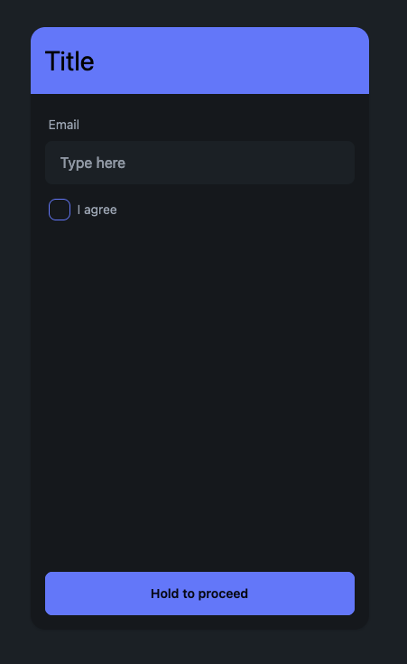

# Test 2

Этим тестом мы хотим оценить:

-   ваше понимание реактивности Реакта, умение работать с хуками и с react-router
-   ваш подход к обработке "побочных-эффектов"
-   умение структурировать код

В этой папке уже настроено окружение для разработки, в папке src начато и намерено не закончено это задание - ваша задача его продолжить.
Вы можете писать приложение в папке src как сочтёте нужным для выполнения задачи - в том числе изменять и дописывать уже имеющиеся там компоненты.
Использовать daisyui не обязательно поскольку работа со стилями в этом тесте оцениваться не будет.

При открытии сайта должна автоматически открываться страница 1

### Станица 1 - /login/step-1

Должно быть поле ввода "Email", чекбокс "I agree" и кнопка "Hold to proceed"

Кнопка "Hold to proceed" должна быть кликабельна только если введён валидный email и проставлен чекбокс.

Валидный email должен сохраняться между перезагрузками вкладки и сбрасываться при закрытии.

Чтобы перейти на следующую страницу пользователь должен удерживать кнопку в течении 500 миллисекунд,
в кнопке должен быть таймер пройденного времени и он должен отсчитывать назад если кнопка была отпущена до истечения 500 миллисекунд.

### Страница 2 - /login/step-2

Должна отображать введённый ранее email и иметь 2 кнопки - "Back" и "Confirm".

Кнопка "Back" должна вести на предыдущую страницу.

Кнопка "Confirm" должна инициировать `POST` запрос к `api/endpoint` c данными `{ email: <email entered before> }`.
Если вы используете скрипт `dev` для разработки то "бэкенд" который обработает запрос будет запущен.

После запроса должен открываться попап с текстом "Success!" или "Error!" в зависимости от успешности.
Должно быть возможно закрыть этот попап нажав на кнопку `<` (Назад) которая есть на многих андроид устройствах.
